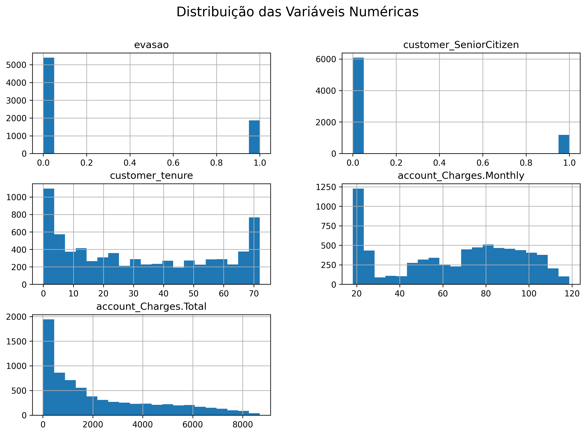
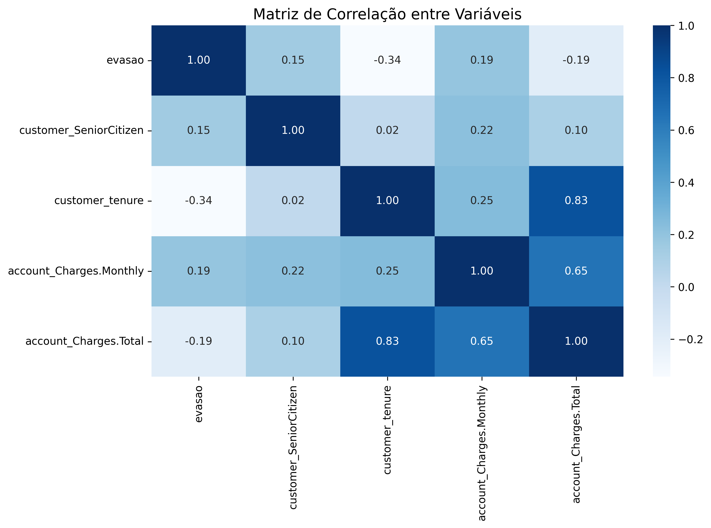
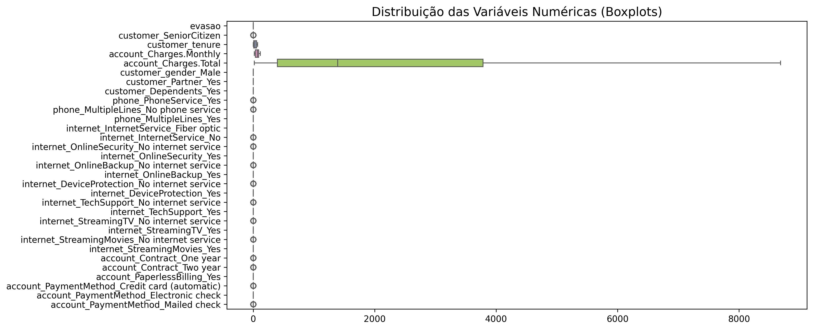
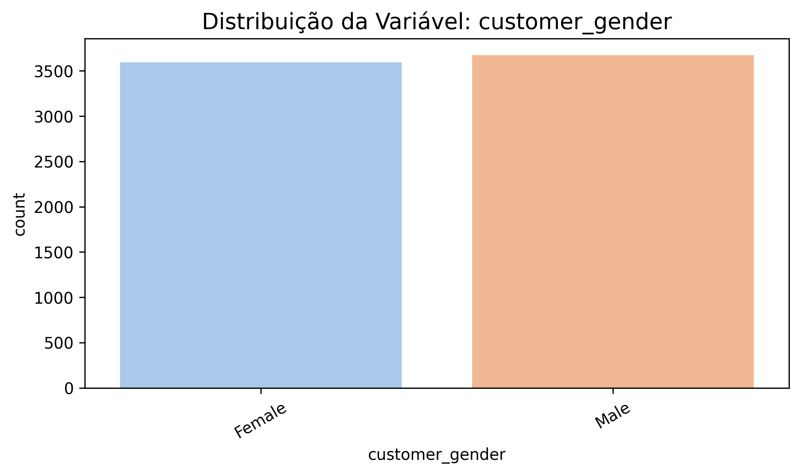
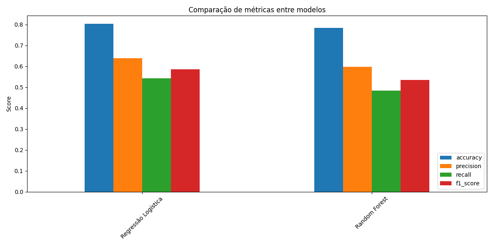
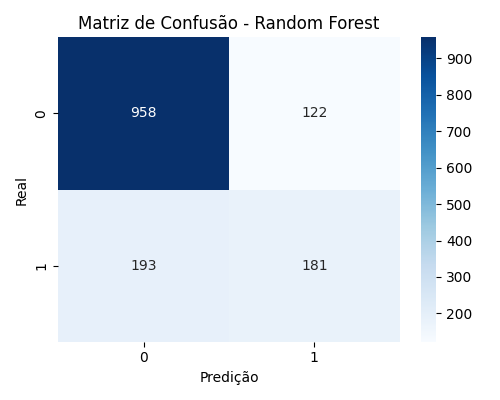
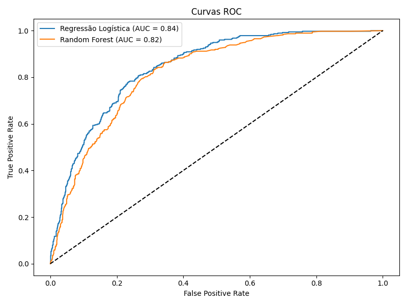
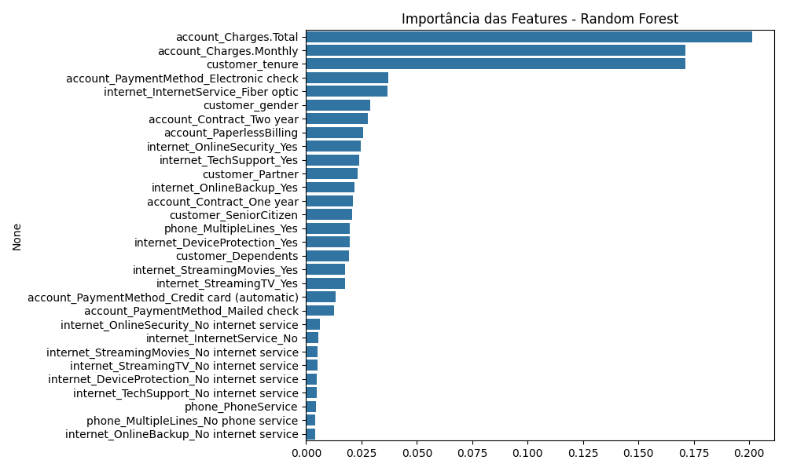

# 📊 Análise de Evasão de Clientes na Telecom X - Parte 2 

Este projeto visa analisar os fatores que influenciam a evasão de clientes (Churn) em uma empresa de telecomunicações e desenvolver modelos de Machine Learning para prever essa evasão. Com base nessa análise, propomos estratégias de retenção para minimizar a perda de clientes.

## 🚀 Preparação dos Dados

Os dados foram carregados, tratados e preparados para a modelagem. As variáveis categóricas foram codificadas e as variáveis numéricas foram normalizadas.

## 📉 Análise Exploratória e Visualizações

Realizamos uma análise exploratória dos dados para entender a distribuição das variáveis e a relação entre elas.

### Distribuição das Variáveis Numéricas

Observamos a distribuição das variáveis numéricas através de histogramas.

### Matriz de Correlação

Analisamos a correlação entre as variáveis para identificar relacionamentos importantes.

### Boxplots das Variáveis Numéricas

Visualizamos a distribuição e a presença de outliers nas variáveis numéricas.

### Distribuição das Variáveis Categóricas

Analisamos a distribuição de cada variável categórica.

## 🧠 Treinamento e Avaliação de Modelos

Treinamos e avaliamos dois modelos de Machine Learning para prever a evasão: Regressão Logística e Random Forest.

### Desempenho dos Modelos

Comparamos as métricas de desempenho dos modelos (Acurácia, Precisão, Recall, F1-Score e AUC-ROC).

### Matrizes de Confusão

Analisamos as matrizes de confusão para entender o desempenho de cada modelo na classificação correta dos clientes.

### Curvas ROC

Comparamos as curvas ROC para avaliar a capacidade dos modelos de distinguir entre as classes.

### Importância das Features (Random Forest)

Analisamos a importância de cada variável na previsão da evasão utilizando o modelo Random Forest.

## 🔑 Principais Fatores de Evasão

Com base na análise de importância das features do modelo Random Forest, os fatores que mais influenciam a evasão de clientes são:

*   **Total de cobranças na conta (`account_Charges.Total`):**
*   **Cobrança mensal da conta (`account_Charges.Monthly`):**
*   **Tempo de contrato (`customer_tenure`):**
*   **Método de pagamento (`account_PaymentMethod_Electronic check`):**
*   **Serviço de Internet (`internet_InternetService_Fiber optic`):**

Outros fatores relevantes incluem: gênero, tipo de contrato, fatura sem papel e serviços de segurança online.

## 💡 Estratégias de Retenção Propostas

Com base nos fatores identificados, propomos as seguintes estratégias para reduzir a evasão de clientes:

*   Programa de Fidelidade para Clientes de Longo Prazo
*   Revisão de Preços e Planos
*   Melhoria na Experiência do Cliente com Pagamento Eletrônico
*   Otimização do Serviço de Fibra Óptica
*   Incentivo a Contratos de Maior Duração
*   Conscientização sobre Segurança Online
*   Campanhas Segmentadas

## ✅ Conclusão

A análise dos dados e a modelagem preditiva nos permitiram identificar os principais impulsionadores da evasão de clientes na Telecom X. Implementar as estratégias de retenção propostas, focando nesses fatores, pode ser fundamental para melhorar a satisfação do cliente e reduzir a taxa de Churn.
